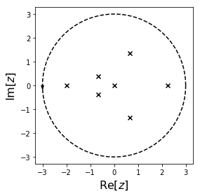

# cxroots
A Python module to compute all the roots of a function  of a single complex variable which lie within a given contour .  The function  must:

* have no roots or poles on 
* be analytic in the interior of 

The implementation is based on the method in [1].


```python
from numpy import exp, cos, sin
f = lambda z: (z*(z+2))**2 * (exp(2*z)*cos(z)-1-sin(z)+z**5)

from cxroots import Circle
C = Circle(0,3)
roots = C.roots(f)
roots.show()
```





```python
print(roots)
```

     Multiplicity |               Root              
    ------------------------------------------------
          2       | -2.000000000000 -0.000000000000i
          1       | -0.651114070264 -0.390425719088i
          1       | -0.651114070264 +0.390425719088i
          3       |  0.000000000000 +0.000000000000i
          1       |  0.648578080954 -1.356622683988i
          1       |  0.648578080954 +1.356622683988i
          1       |  2.237557782467 +0.000000000000i


### Installation
cxroots requires [Python](https://www.python.org/downloads/).  Python 2 and 3 are both compatible.

To install cxroots click the green download button above and then from the command line run
```bash
pip install -r requirements.txt
python setup.py install
```

### Documentation
For a tutorial on the use of this module and a description of how it works see the [documentation](https://rparini.github.io/cxroots/).

### See also
The Fortran 90 package [ZEAL](http://cpc.cs.qub.ac.uk/summaries/ADKW_v1_0.html) is a direct implementation of [1].

---

#### References
[1] Kravanja, Peter, and Marc Van Barel. "Zeros of analytic functions." Computing the Zeros of Analytic Functions. Springer Berlin Heidelberg, 2000. 1-59.

