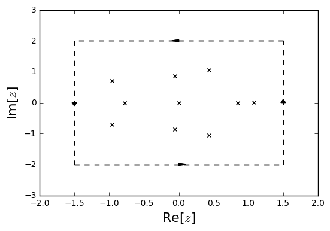

# cxroots
A Python module to compute all the (simple) roots of an analytic function within a given contour.

---

## Introduction

Given a contour  in the complex plane and a function  (and optionally it's derivative ) which:

* Has no roots or poles on 
* Is analytic in the interior of 
* Has only simple roots in the interior of 

the module is able to compute all the roots of within .


```python
from cxroots import Rectangle, showRoots, findRoots, demo_findRoots
from numpy import sin, cos

rect = Rectangle([-1.5,1.5],[-2,2])
f  = lambda z: z**10 - 2*z**5 + sin(z)*cos(z/2)
showRoots(rect, f)
```





The implementation is primarily based on [1] where the number of roots within a contour, , is calculated by numerical integration of the Cauchy integral,

<p align="center"></p>

The original contour is subdivided until each sub-contour only contains a single root and then the Newton-Raphson method is repeatedly used with random startpoints until the root within each sub-contour is found.

If  is not provided by the user then it is approximated with a Taylor expansion as in [2].

### Future improvements:
* Allow for multiplicities of roots within .  Perhaps using the method of formal orthogonal polynomials suggested in [3]
* Approximate the roots of  within a contour as the zeros of a constructed polynomial [2]
* If  is not provided then use the approximation to  in the Newton-Raphson method

### Installation
Can be downloaded from GitHub and installed by running the included 'setup.py' with
```bash
python setup.py install
```

### Documentation
For a tutorial on the use of this module and a discrption of how it works see the [documentation](https://rparini.github.io/cxroots/).

---

#### References
[1] M. Dellnitz, O. Schütze and Q. Zheng, "Locating all the Zeros of an Analytic Function in one Complex Variable" J. Compu. and App. Math. (2002) Vol. 138, Issue 2

[2] L.M. Delves and J.N. Lyness, "A Numerical Method for Locating the Zeros of an Analytic function" Mathematics of Computation (1967) Vol.21, Issue 100

[3] P. Kravanja, T. Sakurai and M. Van Barel, "On locating clusters of zeros of analytic functions" BIT (1999) Vol. 39, No. 4
