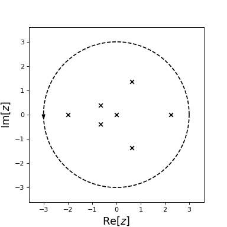

.. image:: https://travis-ci.org/rparini/cxroots.svg?branch=master

cxroots
=======

cxroots is a Python package for finding all the roots of a function, *f(z)*, of a single complex variable within a given contour, *C*, in the complex plane.  It requires only that:

-  *f(z)* has no roots or poles on *C*
-  *f(z)* is analytic in the interior of *C*

The implementation is primarily based on [KB] and evaluates contour integrals involving *f(z)* and its derivative *f'(z)* to determine the roots.  If *f'(z)* is not provided then it is approximated using a finite difference method.  The roots are further refined using Newton-Raphson if *f'(z)* is given or Muller's method if not.

.. code:: python

    from numpy import exp, cos, sin
    f = lambda z: (exp(2*z)*cos(z)-1-sin(z)+z**5)*(z*(z+2))**2
    
    from cxroots import Circle
    C = Circle(0,3)
    roots = C.roots(f)
    roots.show()

.. code:: python

    print(roots)

.. literalinclude:: readmeExOut.txt

Documentation
-------------

See the `documentation <https://rparini.github.io/cxroots/>`_ for more details and examples.

Installation
------------

Install on the command line with 

.. code:: bash

    pip install cxroots
