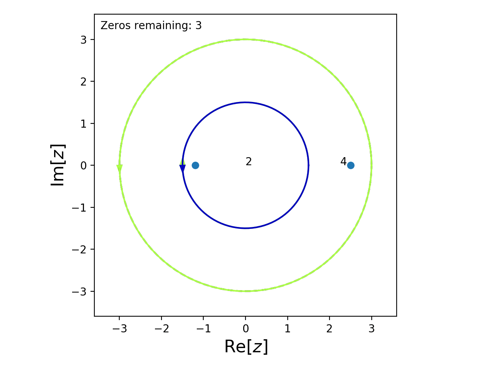
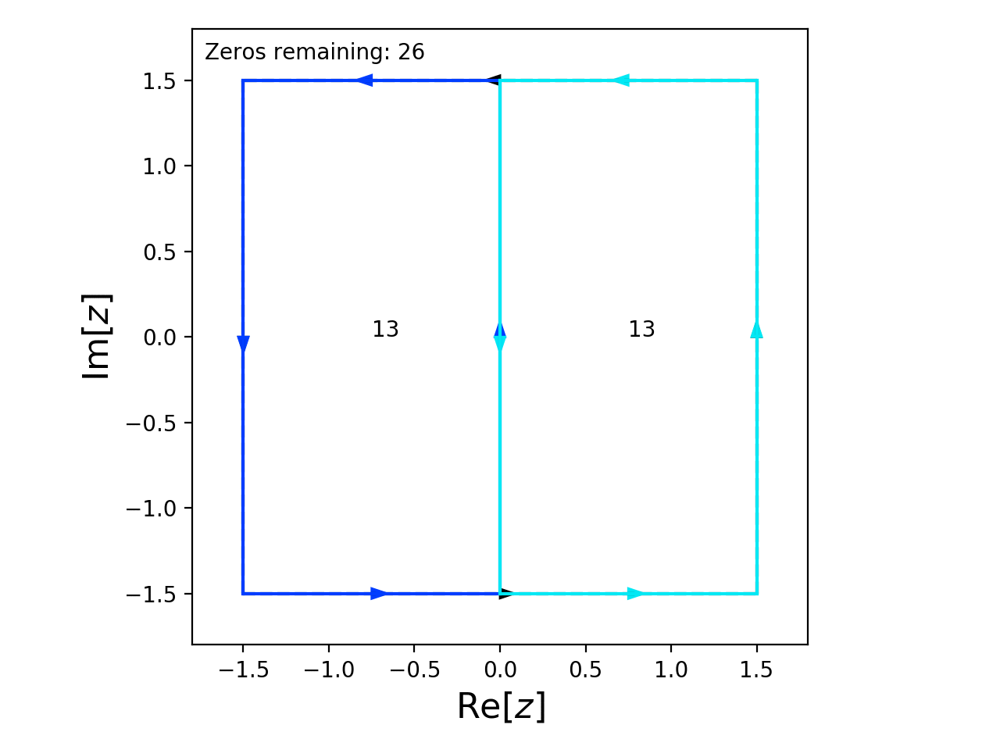

Using Known Roots or Symmetries
===============================

Guessing Roots
--------------

The `guessRoots` argument of :func:`Contour.roots <cxroots.Contour.Contour.roots>` can be used to supply any roots the user already knows or suspects.
For example, suppose we want to find the roots of the function

.. math::

	f(z)=(z+1.2)(z-2.5)^2\left(e^{-z}\sin\left(\frac{z}{2}\right)-1.2\cos(z)\right)\,, \quad |z|<3

It's obvious that 2.5 and -1.2 are roots so we can tell cxroots this by passing :code:`guessRoots=[2.5, -1.2]` to :func:`C.roots()`.

.. code-block:: python

	from numpy import exp, sin, cos
	from cxroots import Circle
	C = Circle(0, 3)
	f = lambda z: (exp(-z)*sin(z/2)-1.2*cos(z))*(z+1.2)*(z-2.5)**2
	C.roots(f, guessRoots=[2.5, -1.2])

This causes cxroots to first check for roots within small circles centered on the points 2.5 and -1.2

.. plot:: 

	from numpy import exp, sin, cos
	from cxroots import Circle
	C = Circle(0, 3)
	f = lambda z: (exp(-z)*sin(z/2)-1.2*cos(z))*(z+1.2)*(z-2.5)**2
	C.demo_roots(f, guessRoots=[2.5, -1.2], saveFile='guessRoots.gif', writer='imagemagick')

Note that the list we supply to `guessRoots` simply tells `cxroots` where to look first for roots, the guesses will not be blindly accepted so they do not need to be particularly accurate.

Guessing Root Symmetry
----------------------

It may be that something is known about the structure of the roots.
`cxroots` can be told this using the `guessRootSymmetry` argument which should be a function of a complex number, :math:`z`, which returns a list of roots assuming that :math:`z` is a root. 

For example, if :math:`z_i` is a root of 

.. math::
	
	f(z)=z^{26}-2z^{10}+\frac{1}{2}z^6-1

then so is :math:`\overline{z_i}` and :math:`-z_i`.
We should therefore pass :code:`guessRootSymmetry=lambda z: [z.conjugate(), -z]` to :func:`C.roots()`

.. code-block:: python

	from cxroots import Rectangle
	C = Rectangle([-1.5,1.5], [-1.5,1.5])
	f  = lambda z: z**26-2*z**10+0.5*z**6-1
	df = lambda z: 26*z**25-20*z**9+3*z**5
	C.roots(f, df, guessRootSymmetry=lambda z: [z.conjugate(), -z])

This causes `cxroots` to check for roots within a small circle centered on the points :math:`\overline{z_i}` and :math:`-z_i` whenever a root, :math:`z_i`, is found.

.. plot:: 

	from cxroots import Rectangle
	C = Rectangle([-1.5,1.5], [-1.5,1.5])
	f  = lambda z: z**26-2*z**10+0.5*z**6-1
	df = lambda z: 26*z**25-20*z**9+3*z**5
	C.demo_roots(f, df, guessRootSymmetry=lambda z: [z.conjugate(), -z], saveFile='ex_rootSymmetry.gif', writer='imagemagick')

