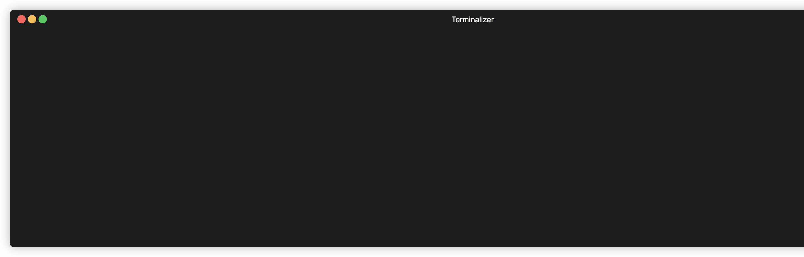

Viewing Progress
================

Progress Bar
------------

Passing the `verbose=True` argument to the `Contour.roots` method or `find_roots` function will cause a progress bar to be printed:

.. literalinclude:: docex_progress.py
	:language: python

Logging
-------

More detailed runtime information is available using Python's standard logging module, for example:

.. literalinclude:: docex_logging.py
	:language: python

.. program-output:: python3 -c "from docex_logging import *"

Logging with Progress Bar
-------------------------

To get the logs to neatly stream above the progress bar the logging config needs to be passed the `RichHandler` like so:

.. literalinclude:: docex_logging_progress.py
	:language: python

.. image:: cxroots_logging_progress.gif
